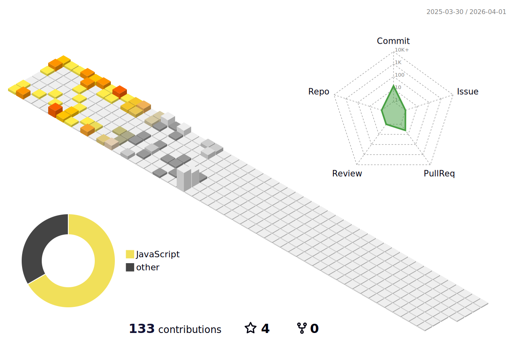

    

        
        
        
    

    

        <h3> Hi guys 👋 </h3> 
        I'm a tech enthusiast⚡️ that never had the opportunity to learn programming until recently.  
        I was always interested in making things and solving problems and difficulties but didn't know-how in the real world.  
        It's been an incredible journey of self-discovery and it's only just begun. 
        👀 Currently learning Python and Backend development
    

     🌱 I’m interested in 
       ✍🏻 Design
       📖 Reading
       🧘🏼‍♀️ Meditation

 
 

    
<!-- 
 -->

## ✨  GitHub Stats
    

 
  
📊 3D Profile Stats

    

  
   

    
    

    

 
 

    
  ## 🛠 Platforms & Languages ✍🏻

   
  
  
  
  
<!--    -->
   
  
  
  
  
    
  
  

