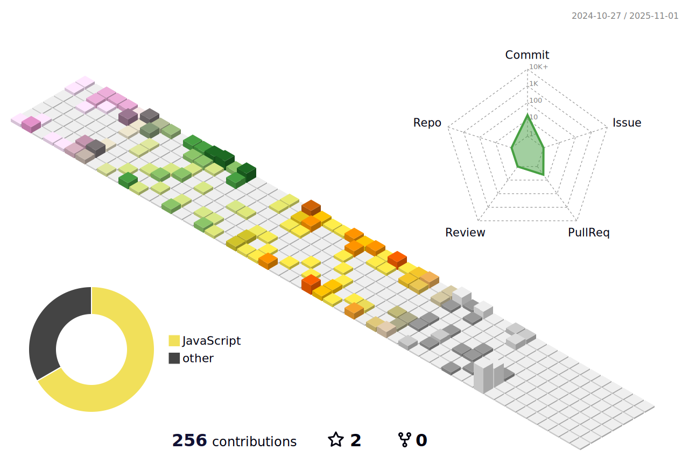

<!-- <a href="https://hashnode.com/@clairechung" target="_blank"> -->
</a>

    

        <h3> Hi 👋 </h3> 
        I'm a tech enthusiast⚡️ that never had the opportunity to learn programming until recently.  
        I was always interested in making things and solving problems and difficulties but didn't know-how in the real world.  
        It's been an incredible journey of self-discovery and it's only just begun. 
        👀 Currently learning Typescript, GraphQL, Kubernetes.
    

    
     🌱 I’m interested in 
     📖 Reading
       Favorite: Tools of Titans, Atomic Habits, The Social Animal
       Currently reading Unscripted and Factfulness
     🧘🏼‍♀️ Meditation

 
 

  
    
<!-- 
 -->

<!-- 
 
  
📊 3D Profile Stats

    

  
   

    
    

 -->
    

 

    
  ### ✍🏻 Platforms & Languages 
      
<!-- <h4 align="center">Languages and Tools:</h4> -->

                  

    
    
    
<!-- 

  
  
  
  
   
   
  
  
  
  
    
  
  

 -->

